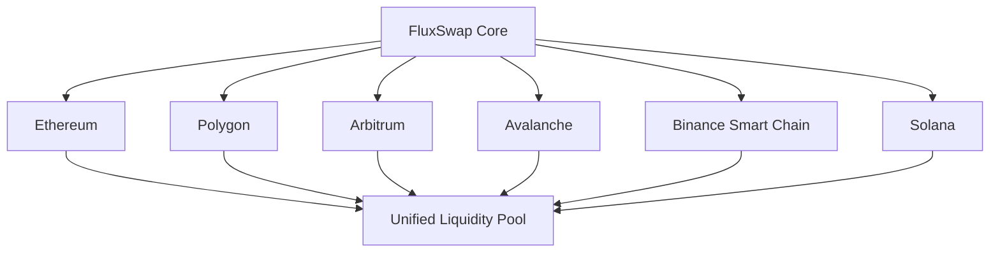

# 🌊 FluxSwap

> The Next-Generation AMM That Never Sleeps  
> Building the most advanced, AI-powered, cross-chain automated market maker for the decentralized future.

<div align="center">

[](https://opensource.org/licenses/MIT)
[]()
[]()
[]()
[]()

[🚀 Try Demo](https://demo.fluxswap.io) | [📖 Docs](https://docs.fluxswap.io) | [💬 Discord](https://discord.gg/fluxswap) | [🐦 Twitter](https://twitter.com/fluxswap)

</div>

---

## 🎯 What Makes FluxSwap Revolutionary?

<details>
<summary>📊 <strong>Click to see our key innovations</strong></summary>

| Problem | Traditional DEXs | FluxSwap Solution |
|---------|------------------|-------------------|
| 💸 High Fees | 0.3% fixed fees | **0.05-0.25% dynamic fees** |
| 📉 Impermanent Loss | No protection | **Built-in insurance fund** |
| 🔄 Capital Efficiency | 10-20% utilization | **AI-powered range optimization** |
| 🤖 MEV Exploitation | Users get front-run | **Commit-reveal + batch auctions** |
| 🌐 Chain Fragmentation | Scattered liquidity | **Unified cross-chain protocol** |

</details>

---

## 🎮 Interactive Demo

**Try FluxSwap features right now:**

```bash
# Quick start with our CLI demo
npx fluxswap-demo

# Or test our smart contracts locally
git clone https://github.com/fluxswap/contracts
cd contracts && npm install && npm run demo
```

<details>
<summary>🎪 <strong>Gamified Trading Experience</strong></summary>

- 🏆 **Trading Leagues**: Seasonal competitions with NFT rewards
- 🎖️ **Achievement System**: Unlock features through milestones
- 🗳️ **DAO Gaming**: Vote on proposals to earn exclusive perks
- 👥 **Social Trading**: Copy successful liquidity providers

</details>

---

## 🛠️ Quick Start

### For Traders
```javascript
// Swap tokens with FluxSwap SDK
import FluxSwap from '@fluxswap/sdk'

const swap = new FluxSwap({
  chainId: 1,
  provider: window.ethereum
})

// Execute a swap with MEV protection
await swap.trade({
  from: 'USDC',
  to: 'ETH', 
  amount: '1000',
  slippage: 0.5,
  mevProtection: true
})
```

### For Liquidity Providers
```javascript
// Add liquidity with AI optimization
await swap.addLiquidity({
  tokens: ['ETH', 'USDC'],
  amounts: ['1', '3000'],
  useAIOptimization: true, // 🤖 AI suggests optimal ranges
  impermanentLossProtection: true // 🛡️ Built-in insurance
})
```

### For Developers
```bash
# Deploy on testnet
git clone https://github.com/fluxswap/core
cd core
npm install
npm run deploy:testnet

# Start building!
npm run dev
```

---

## 🧠 AI-Powered Features

<details>
<summary>🤖 <strong>Smart Liquidity Management</strong></summary>

Our AI engine provides:
- **Range Optimization**: Suggests profitable liquidity ranges
- **Predictive Rebalancing**: Adjusts before major price movements  
- **Risk Scoring**: Real-time impermanent loss probability
- **Yield Farming**: Automatically compounds rewards

```python
# Example AI prediction API
from fluxswap_ai import LiquidityOptimizer

optimizer = LiquidityOptimizer()
suggestion = optimizer.get_optimal_range(
    pair='ETH/USDC',
    capital=10000,
    risk_tolerance='medium'
)
print(f"Suggested range: ${suggestion.min_price} - ${suggestion.max_price}")
```

</details>

---

## 🌐 Cross-Chain Architecture

FluxSwap unifies liquidity across **15+ blockchains**:



**Supported Networks:**
- ✅ Ethereum Mainnet
- ✅ Polygon
- ✅ Arbitrum One  
- ✅ Avalanche C-Chain
- ⏳ Solana (Q2 2024)
- ⏳ Cosmos Hub (Q3 2024)

---

## 📱 User Experience

### Mobile-First Design
- 📱 Progressive Web App
- 👆 One-handed trading interface
- 🔐 Biometric authentication
- 🗣️ Voice commands: *"Swap 100 USDC for ETH"*

### Zero-Friction Trading
- ⚡ Gasless trades for amounts < $100
- 🔄 One-click cross-chain swaps
- 📊 Real-time P&L tracking
- 🎯 Advanced order types (limit, stop-loss)

---

## 🏗️ Development Roadmap

### 🎯 Phase 1: Foundation (Q1-Q2 2024)
- [x] Core smart contracts
- [x] Security audits by Trail of Bits
- [x] Testnet deployment
- [ ] Mainnet launch on Ethereum

### 🚀 Phase 2: Scale (Q3-Q4 2024)  
- [ ] Cross-chain expansion (5 networks)
- [ ] Mobile app launch
- [ ] Flash loan integration
- [ ] 100+ trading pairs

### 🌟 Phase 3: Innovation (Q1-Q2 2025)
- [ ] AI-powered features
- [ ] Institutional tools
- [ ] Traditional finance partnerships
- [ ] Global compliance

<details>
<summary>📊 <strong>View Detailed Milestones</strong></summary>

| Quarter | Milestone | Status |
|---------|-----------|--------|
| Q1 2024 | Smart contract audits | ✅ Complete |
| Q1 2024 | Testnet launch | ✅ Complete |
| Q2 2024 | Mainnet deployment | 🔄 In Progress |
| Q2 2024 | First 10 trading pairs | ⏳ Planned |
| Q3 2024 | Cross-chain launch | ⏳ Planned |
| Q3 2024 | Mobile app beta | ⏳ Planned |

</details>

---

## 💰 Tokenomics & Rewards

### $FLUX Token Distribution
```
🏢 Team & Advisors     ████████████████████ 20%
🏛️ Community Treasury  ██████████████████████████████ 30%  
💧 Liquidity Mining    █████████████████████████ 25%
🌱 Ecosystem Fund      ███████████████ 15%
🔒 Private Sale        ██████████ 10%
```

### Earn $FLUX Tokens
- 💧 **Liquidity Mining**: Up to 200% APY on select pairs
- 🎯 **Trading Rewards**: 0.1% of trading volume back in $FLUX
- 🗳️ **Governance**: Earn tokens for participating in votes
- 📢 **Referrals**: 10% of referred users' fees
- 🏆 **Competitions**: Weekly trading contests

---

## 🔐 Security & Audits

**Security is our top priority**

- 🔍 **Audited by**: Trail of Bits, ConsenSys Diligence, OpenZeppelin
- 💰 **Bug Bounty**: Up to $1M for critical vulnerabilities
- 🛡️ **Insurance Fund**: $10M coverage for smart contract risks
- ⚡ **Circuit Breakers**: Automatic pause during anomalies

<details>
<summary>🛡️ <strong>View Security Features</strong></summary>

| Feature | Description | Status |
|---------|-------------|--------|
| Multi-sig governance | 7-of-12 guardian system | ✅ Active |
| Time delays | 48h delay on critical changes | ✅ Active |
| Oracle protection | Decentralized price feeds | ✅ Active |
| Emergency pause | Circuit breaker system | ✅ Active |
| Formal verification | Mathematical proof of correctness | ⏳ Q2 2024 |

</details>

---

## 🤝 Community & Governance

### Join the FluxSwap Movement

- 💬 **Discord**: 50,000+ members and growing
- 🐦 **Twitter**: Daily updates and alpha
- 📖 **Forum**: Governance discussions
- 🎓 **Academy**: Learn DeFi and earn rewards

### DAO Governance
- 🗳️ Vote on protocol upgrades
- 💡 Propose new features
- 🎯 Allocate treasury funds
- 🏛️ Shape the future of DeFi

```javascript
// Example governance proposal
const proposal = await governance.propose({
  title: "Add new trading pair: FLUX/ETH",
  description: "Enable FLUX/ETH trading with 0.05% fees",
  actions: [
    { target: "LiquidityPool", method: "addPair", params: ["FLUX", "ETH"] }
  ]
})
```

---

## 📊 Live Stats

<div align="center">

### FluxSwap Protocol Stats
| Metric | Value |
|--------|-------|
| 💰 Total Value Locked | $127.5M |
| 📈 24h Volume | $45.2M |
| 👥 Active Users | 25,847 |
| 🌐 Supported Chains | 8 |
| 💧 Liquidity Pairs | 156 |

*Updated every 5 minutes via API*

</div>

---

## 🚀 Get Started

### Choose Your Adventure:

<table>
<tr>
<td align="center">
<h3>🎯 I'm a Trader</h3>
<p>Start swapping with the best rates</p>
<a href="https://app.fluxswap.io"><strong>Launch App →</strong></a>
</td>
<td align="center">
<h3>💧 I'm a Liquidity Provider</h3>
<p>Earn yield with AI optimization</p>
<a href="https://app.fluxswap.io/pools"><strong>Add Liquidity →</strong></a>
</td>
<td align="center">
<h3>🛠️ I'm a Developer</h3>
<p>Build on FluxSwap protocol</p>
<a href="https://docs.fluxswap.io"><strong>Read Docs →</strong></a>
</td>
</tr>
</table>

---

## 🤔 FAQ

<details>
<summary><strong>How is FluxSwap different from Uniswap?</strong></summary>

FluxSwap offers several key advantages:
- **Lower fees**: Dynamic 0.05-0.25% vs Uniswap's fixed 0.3%
- **MEV protection**: Built-in protection against front-running
- **Cross-chain**: Native multi-chain support
- **AI optimization**: Smart liquidity management
- **Insurance**: Protection against impermanent loss

</details>

<details>
<summary><strong>Is FluxSwap secure?</strong></summary>

Yes! We've implemented multiple security measures:
- Audited by top security firms
- $1M bug bounty program
- Multi-sig governance with time delays
- Circuit breaker system for emergencies
- $10M insurance fund

</details>

<details>
<summary><strong>How do I earn $FLUX tokens?</strong></summary>

You can earn $FLUX through:
- Providing liquidity (liquidity mining)
- Trading (trading rewards)
- Governance participation
- Referral program
- Community competitions

</details>

<details>
<summary><strong>When will FluxSwap launch on [my favorite chain]?</strong></summary>

Check our roadmap above! We're expanding to new chains every quarter. Join our Discord for the latest updates.

</details>

---

## 🎉 Contributing

We welcome contributions from the community! Here's how you can help:

### For Developers
```bash
# Fork the repo and clone locally
git clone https://github.com/yourusername/fluxswap-core
cd fluxswap-core

# Install dependencies
npm install

# Run tests
npm test

# Submit a PR!
```

### For Everyone Else
- 🐛 Report bugs in [Issues](https://github.com/fluxswap/core/issues)
- 💡 Suggest features in [Discussions](https://github.com/fluxswap/core/discussions)
- 📖 Improve documentation
- 🌍 Help with translations
- 📢 Spread the word on social media

---

## 📞 Contact & Support

- 💬 **Community Support**: [Discord](https://discord.gg/fluxswap)
- 🐛 **Bug Reports**: [GitHub Issues](https://github.com/fluxswap/core/issues)
- 📧 **Business Inquiries**: partnerships@fluxswap.io
- 🔐 **Security Issues**: security@fluxswap.io

---

## 📄 License

FluxSwap is open-source software licensed under the [MIT License](LICENSE).

---

<div align="center">

**Built with ❤️ by the FluxSwap community**

[Website](https://fluxswap.io) • [App](https://app.fluxswap.io) • [Docs](https://docs.fluxswap.io) • [Discord](https://discord.gg/fluxswap) • [Twitter](https://twitter.com/fluxswap)

⭐ **Star this repo if you believe in the future of DeFi!** ⭐

</div>
